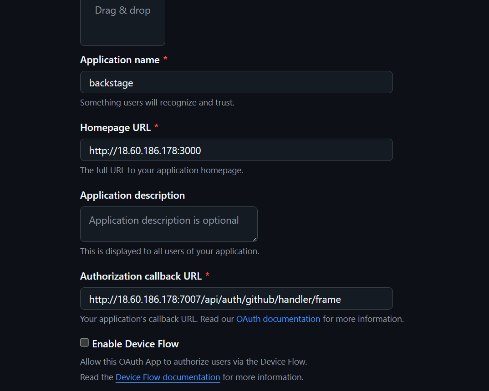

# backstage-docs
hi in this document you will get all the details u will need to run the backstage app  
in here i will share some links from where u can get help if u get stuck  

- https://www.udemy.com/course/from-devops-to-platform-engineering-master-backstage-idps/learn/lecture/45907599#overview
- https://backstage.io/docs/overview/what-is-backstage

## some github links that are used in the project 
link for backstage app that u can clone where u want to run  
- https://github.com/sahil7879/backstage-app.git

 link for template  
- https://github.com/sahil7879/backstage-software-templates.git

link for the demo flask project  
- https://github.com/sahil7879/python-app.git

# some changes u will want to do before u run the project 

## Ready your github integration 

- you will need a github private token
- you will also need to create a github oauth app 



In this i have given ip address of my instance if u have cloned it locally  
Then use localhost instead of ip address  

save the three in a text file for further use 
```
GITHUB_CLIENT_ID
GITHUB_CLIENT_SECRET
GITHUB_TOKEN
```
# now u have two options 
option 1 already created instace with backstage and most of the things ready just have to do credentials  
option 2 clone the above backstage app repo and start by Yourself  
bonus option 3 create a the whole backstage app by yourself and start from scratch using documentaion and udemy course  
## option 1 in our aws account in hydrabad region we have t2 large instance use that instance i have given the key side by side with this repo link
- create your github credentials
- change in the users.yaml file and add your own user in that file
- export your creds as env variable
how to do these more details in next option  
no need to do other steps just these 3 steps  

## option 2 Now lets got to the place where you have cloned the backstage
Question do u have your nodejs installed ? 
```
node -v
```
if not install than
```
apt update -y && apt upgrade -y
curl -fsSL https://deb.nodesource.com/setup_18.x -o nodesource_setup.sh
sudo -E bash nodesource_setup.sh
sudo apt-get install -y nodejs
npm install -g corepack
yarn set version stable
yarn install
apt install docker.io -y
```
First go to the directory of backstage 
```
cd backstage-app
```
Now make some changes in app.config.yaml file 
```
vi app.config.yaml
```
In app.config.yaml, change three urls there in which it has ip addresses to localhost with those same ports and everything u just need to change ips 
check if you have app.config.local.yaml file if not create a new one
```
vi app.config.local.yaml
```
paste this content
```
# Backstage override configuration for your local development environment
app:
  listen:
    host: 0.0.0.0
auth:
  environment: development
  providers:
    github:
      development:
        clientId: ${GITHUB_CLIENT_ID}
        clientSecret: ${GITHUB_CLIENT_SECRET}
        signIn:
          resolvers:
            # Matches the GitHub username with the Backstage user entity name.
            # See https://backstage.io/docs/auth/github/provider#resolvers for more resolvers.
            - resolver: usernameMatchingUserEntityName

integrations:
  github:
    - host: github.com
      token: ${GITHUB_TOKEN} # this will use the environment variable GITHUB_TOKEN
backend:
  database:
    client: pg
    connection:
      host: localhost
      port: 5432
      user: backstage
      password: backstage
      database: backstage
techdocs:
  builder: 'local'
  generator:
    runIn: local
  publisher:
    type: 'local'


catalog:
  locations:
    # Local example data, file locations are relative to the backend process, typically `packages/backend`
    - type: file
      target: /root/backstage-app/catalog/entities/users.yaml
      rules:
        - allow: [User]
    - type: file
      target: /root/backstage-app/catalog/entities/groups.yaml
      rules:
        - allow: [Group]
    - type: url
      target: https://github.com/sahil7879/backstage-software-templates/blob/main/python-app/template.yaml
      rules:
        - allow: [Template]
```
You will also need to start a container of postgres for backend, use this command 
``` bash
docker run -d \
  --name backstage-postgres \
  -e POSTGRES_USER=backstage \
  -e POSTGRES_PASSWORD=backstage \
  -e POSTGRES_DB=backstage \
  -p 5432:5432 \
  postgres:15
```
Next make changes in the users file for integration purposes 
```
vi catalog/entities/users.yaml
```
Change the name part to the username of your github
```
apiVersion: backstage.io/v1alpha1
kind: User
metadata:
  name: sahil7879
spec:
  memberOf: [developer]
```
in case of adding a new user use this  and change the user in the second part
```
apiVersion: backstage.io/v1alpha1
kind: User
metadata:
  name: sahil7879
spec:
  memberOf: [developer]
---
apiVersion: backstage.io/v1alpha1
kind: User
metadata:
  name: sahil7879
spec:
  memberOf: [developer]
```
and also set your environment variable 
```
export GITHUB_CLIENT_ID=xyz
export GITHUB_CLIENT_SECRET=xyz
export GITHUB_TOKEN=xyz
```
 make sure you are in backstage-app directory  
and start your backstage by using 
```
yarn start 
```
wait for line in the end  

webpack compiled successfully 

access your backstage app in your browser 
http://ip:3000


## bonus option 3 
guide in case of ubuntu  
install these packages first  
```
apt update -y && apt upgrade -y
curl -fsSL https://deb.nodesource.com/setup_18.x -o nodesource_setup.sh
sudo -E bash nodesource_setup.sh
sudo apt-get install -y nodejs
npm install -g corepack
yarn set version stable
yarn install
apt install docker.io -y
```
then use this command to create a new backstage application  

```
npx @backstage/create-app@latest
```
enter yes the name of the app whatever you want to give  
after that u can follow udemy course and the documentaion  
